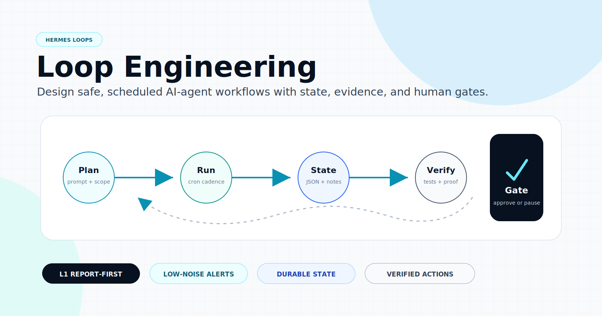
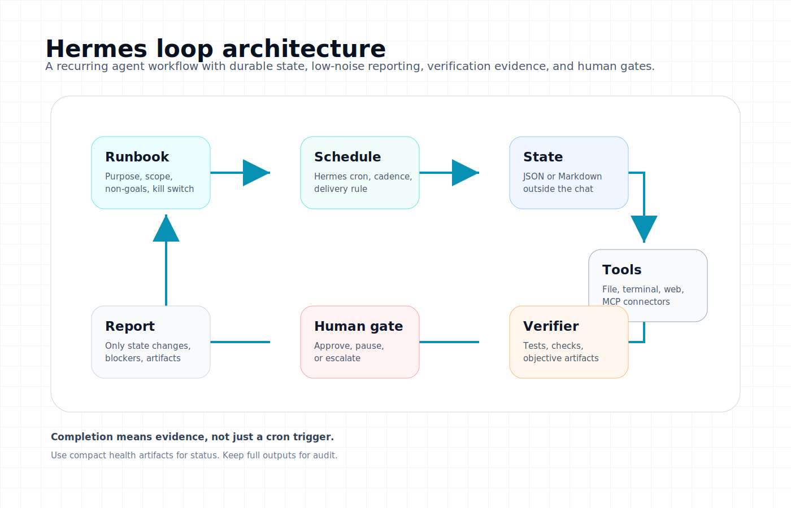

# Hermes Loop Engineering



[](https://github.com/gregoryhorn/hermes-loop-engineering/actions/workflows/validate.yml)


**Hermes Loop Engineering** is a public starter kit for building **safe, stateful, scheduled AI-agent loops** in Hermes Agent.

It is for Hermes users who already have the agent running and want recurring work to be quieter, safer, easier to inspect, and backed by real verification evidence.

A good loop is a small operating system around repeated work:

```text
prompt/runbook -> schedule -> durable state -> evidence -> verifier -> human gate
```

This repository contains:

- an installable Hermes skill (`skill/SKILL.md`)
- public-safe loop templates
- example prompts for common recurring workflows
- permissive state schemas and validation checks
- readiness, link, state, and artifact checks
- polished diagrams for explaining the loop model

It does **not** contain private loops, credentials, personal schedules, internal state, social accounts, or production configuration.

## Why this exists

Recurring agent work becomes risky when it has no state, no scope, no stop criteria, and no verification. Loop engineering makes recurring AI automation explicit:

- What may the loop inspect?
- What may it change, if anything?
- Where does state live outside the chat?
- What evidence proves success?
- When should it stay quiet?
- When should it escalate to a human?
- How do you pause, kill, or roll it back?

## Visual model



## The Hermes mapping

| Loop concept | Hermes primitive |
|---|---|
| Schedule / automation | `hermes cron` / `/cron` / `cronjob` tool |
| Reusable operating knowledge | Hermes skills |
| Short maker/checker split | `delegate_task` |
| Long-running bounded jobs | `terminal(background=true, notify_on_complete=true)` |
| Durable state | JSON/Markdown state file, wiki page, or Kanban board |
| External tools | Hermes toolsets, MCP servers, browser/web/file/terminal tools |
| Human gate | final report, approval batch, issue, PR, or message |

## Quick start

This guide assumes you already use Hermes Agent. You should be able to run Hermes, list cron jobs, and load skills in your normal Hermes environment.

By the end you will have a quiet **L1 report-only loop** with:

- a self-contained prompt
- a durable state file
- a clear watched scope
- no write permissions
- state-change-only reporting
- a first-run smoke check

### 1. Clone the starter

```bash
git clone https://github.com/gregoryhorn/hermes-loop-engineering.git
cd hermes-loop-engineering
```

### 2. Install the Loop Engineering skill

```bash
./scripts/install-hermes-loop-skill.sh
```

Then start a fresh Hermes session or reload skills if your interface supports it.

Quick sanity check:

```bash
hermes skills list | grep -i loop
hermes cron list
```

### 3. Pick a report-only pattern

Start from one of the example prompts in [`examples/`](examples/). Good first choices:

| Goal | Example prompt |
|---|---|
| Review a project workspace every morning | `examples/daily-project-triage.prompt.md` |
| Watch CI and summarize failures | `examples/pr-ci-babysitter.prompt.md` |
| Keep docs or a wiki tidy | `examples/knowledge-base-maintenance.prompt.md` |
| Watch dependency drift | `examples/dependency-watch.prompt.md` |
| Monitor a service without spam | `examples/service-health-watchdog.prompt.md` |

### 4. Create durable state

```bash
mkdir -p ~/.hermes/state/loops
cp templates/state.example.json ~/.hermes/state/loops/my-first-loop.json
```

Edit the copied file before scheduling. At minimum, set the loop id, purpose, watched scope, and owner fields for your environment.

Validate it:

```bash
python scripts/validate_loop_state.py ~/.hermes/state/loops/my-first-loop.json
```

Recommended fields may warn while you are drafting. Missing required fields should be fixed before scheduling.

### 5. Ask Hermes to create the loop

Paste this into Hermes and customize the example path, state path, schedule, and watched scope:

```text
Use the loop-engineering skill. Create an L1 report-only Hermes cron loop from examples/daily-project-triage.prompt.md.

Use durable state at ~/.hermes/state/loops/my-first-loop.json.
The loop may inspect only the project path I name.
It must not edit files, publish, merge, delete, spend money, touch credentials, or change infrastructure.
Deliver only when state changes, blockers appear, risky decisions need approval, or a real artifact is produced.
```

### 6. Smoke-run once before trusting the schedule

After creating the cron job, trigger one run manually or wait for the first scheduled run. A good first run should do one of three things:

- write a useful baseline into the state file
- report one clear blocker with evidence
- stay quiet or return a one-line no-change summary if nothing changed

Check the state file after the first run:

```bash
python -m json.tool ~/.hermes/state/loops/my-first-loop.json >/dev/null
```

### 7. Keep week one report-only

Do not start by letting a loop edit code, publish, merge, delete, mutate infrastructure, or touch credentials. First prove that it can inspect, summarize, update state, and escalate accurately.

## Readiness levels

| Level | Meaning | Minimum bar |
|---|---|---|
| **L0 Draft** | documented intent only | purpose, non-goals, scope, owner, no scheduler |
| **L1 Report** | scheduled/read-only reporting | durable state, scoped inspection, no mutation |
| **L2 Assisted** | narrow changes with verification | isolated worktree or narrow path scope, maker/checker, real command output |
| **L3 Unattended** | allowed to act without supervision | explicit allowlist, budget, attempt caps, kill switch, verifier, human gates |

Most loops should live at **L1** longer than your optimism wants.

## Common loop patterns

Hermes Loop Engineering works well for:

- scheduled AI-agent project triage
- CI and pull request babysitting
- documentation and knowledge-base maintenance
- dependency and release monitoring
- content pipeline checks
- service health watchdogs
- R&D loops that propose improvements without touching private state

These are not just cron prompts. Each loop should have durable state, verification evidence, alert hygiene, and a human gate for risky work.

## Example loop cases

Public-safe examples are in [`examples/`](examples/):

- [`daily-project-triage.prompt.md`](examples/daily-project-triage.prompt.md) - read-only scan of a project workspace
- [`pr-ci-babysitter.prompt.md`](examples/pr-ci-babysitter.prompt.md) - watch PR/CI state, classify failures, escalate
- [`knowledge-base-maintenance.prompt.md`](examples/knowledge-base-maintenance.prompt.md) - validate docs/wiki links and suggest fixes
- [`dependency-watch.prompt.md`](examples/dependency-watch.prompt.md) - watch outdated dependencies, propose safe updates
- [`content-pipeline-monitor.prompt.md`](examples/content-pipeline-monitor.prompt.md) - check local media/content artifacts without publishing
- [`service-health-watchdog.prompt.md`](examples/service-health-watchdog.prompt.md) - script-first state-change watchdog
- [`hermes-loop-engineering-rd.prompt.md`](examples/hermes-loop-engineering-rd.prompt.md) - improve this starter repo over time with validation and public-safety gates

Replace paths, commands, schedules, and boundaries with your own.

## Core safety rules

1. **No state, no loop.** Every loop reads and writes a durable state file or board.
2. **Report-only first.** L1 before L2/L3 unless a human explicitly overrides.
3. **No heartbeat spam.** Notify on changes, blockers, risky decisions, or deliverables.
4. **Implementer does not grade itself.** Use a separate verifier for mutations.
5. **Cron trigger is not completion.** Completion requires evidence from tools or checks.
6. **No broad write scope.** Use narrow allowlists and explicit denylisted areas.
7. **Human-gate risky work.** Auth, secrets, payments, infra, publishing, deletion, and PII stay gated.

## Validate a loop spec

The readiness checker catches missing basics before you schedule something risky:

```bash
python scripts/loop_readiness.py templates/LOOP.example.md
```

Loop state validation is intentionally permissive: required core fields fail the check, recommended operational fields print warnings, and private/local extension fields are allowed.

```bash
python scripts/validate_loop_state.py templates/state.example.json
python scripts/validate_loop_state.py templates/rnd-state.example.json
```

Before publishing documentation changes, also check relative Markdown links:

```bash
python scripts/check_markdown_links.py .
```

## Artifact flow

Loops should keep the full audit trail while surfacing a compact operator view:

- full cron output for audit
- durable state JSON for continuity
- compact `last-response.md` for human review
- compact `health.json` for status and alerting
- deliverable artifacts such as PRs, reports, screenshots, or logs

See [`docs/artifact-flow.md`](docs/artifact-flow.md).

## Discoverability

If you found this repo by searching for Hermes Agent automation, scheduled AI agents, AI agent cron jobs, stateful agent workflows, LLMOps runbooks, MCP automation, or safe AI automation, start with the Quick start above and keep your first loop report-only.

For maintainers, repo topics and public description guidance live in [`docs/discoverability.md`](docs/discoverability.md).

## Repository contents

```text
assets/        Banner, architecture diagram, and social preview assets
docs/          Concepts, setup, safety, artifact flow, and operation docs
examples/      Public-safe example loop prompts
schemas/       Permissive JSON Schema contracts for loop state
skill/         Installable Hermes skill
scripts/       Installer, validation, asset, and response extraction tools
templates/     LOOP.md and state templates
```

## Maintain and improve the starter

Use [`docs/r-and-d-loop.md`](docs/r-and-d-loop.md) and [`examples/hermes-loop-engineering-rd.prompt.md`](examples/hermes-loop-engineering-rd.prompt.md) to set up a recurring R&D loop that improves functionality, documentation, examples, validation, and discoverability while keeping private/local loops gated.

## License

MIT. See [`LICENSE`](LICENSE).

## Acknowledgements

Inspired by the broader loop-engineering discussion in the agent community and adapted specifically for Hermes Agent primitives.
